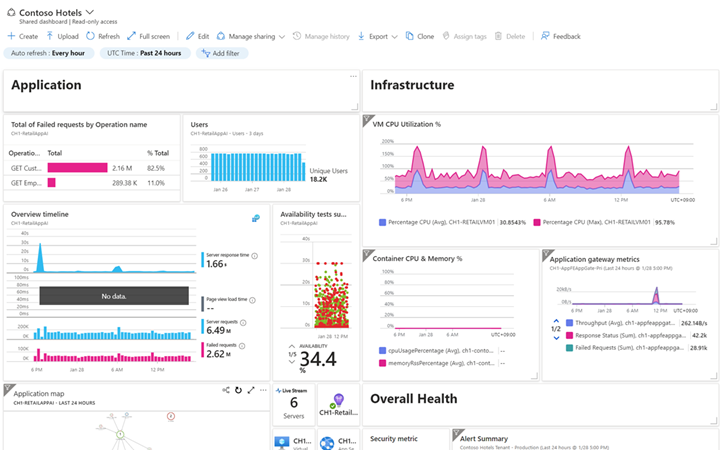

# Azure Dashboard

첫 번째 옵션은 Azure Dashboard입니다. 말 그대로 **Azure Portal 안에서 바로 쓰는 네이티브 대시보드** 라고 보시면 됩니다. 

가장 큰 특징은, 서로 다른 종류의 데이터를 Azure Portal의 한 화면에 타일 형태로 모아서 보여줄 수 있다는 점입니다. 

예를 들어 메트릭 차트, 로그 쿼리 결과, 그리고 Azure Monitor에서 제공하는 여러 시각화 요소들을 한 화면에 섞어서 배치할 수 있습니다. 

그리고 필요하면 이 대시보드를 다른 사용자와 공유할 수도 있습니다.

## 장점
Azure Dashboard의 장점을 정리하면, 

1. 첫째는 Portal 안에서 바로 만든다는 점입니다. 별도 도구나 별도 UI로 이동할 필요가 없고, Azure 리소스를 관리하는 흐름 안에서 그대로 대시보드를 구성할 수 있습니다. 

2. 둘째는 공유와 권한 관리가 단순하다는 점입니다. 대시보드는 기본적으로 개인용으로 만들 수 있고, 공유가 필요하면 게시(publish)해서 팀이 함께 볼 수 있습니다. 이때 접근 제어는 Azure RBAC로 통제됩니다. 

3. 셋째는 자동 새로고침입니다. 운영 화면으로 쓰기 좋게 주기적으로 갱신되는데, 최소 새로고침 간격이 5분이라는 점이 명확하게 정리돼 있습니다. 

4. 넷째는 레이아웃 측면에서 타일 기반으로 배치가 유연하고, 전체 화면 모드 같은 운영 친화 기능도 있습니다.

## 단점
반대로 단점, 즉 "제약"도 존재합니다.

1. 첫 번째는 로그 시각화의 표현력이 제한적이라는 점입니다. 특히 로그 결과를 표 형태로 보여주는 것에 제약이 있고, 로그 차트 쪽은 세밀한 컨트롤이 제한적입니다.
2. 두 번째는 차트의 데이터 시리즈 개수 제한이 있습니다. 한 타일에서 다룰 수 있는 데이터 시리즈가 10개로 제한되고, 그 이상은 묶여서 처리된다는 제약이 명시돼 있습니다. 
3. 세 번째는 로그 차트에서는 커스텀 파라미터 지원이 없다는 점입니다. 즉, 화면에서 값을 바꿔가며 드릴다운하는 'interaction'은 Workbooks나 Grafana 쪽이 더 강합니다. 

## 결론
결론적으로 Azure Dashboard는 **팀이 매일 보는 운영 KPI/상태판** — 예를 들어 주요 리소스들의 핵심 메트릭과, 
몇 개의 로그 요약 타일을 한 화면에 모아두고 ‘오늘 상태가 정상인지’를 빠르게 확인하는 용도에 가장 적합합니다.

[Azure에서 제공하는 시각화 옵션 4가지](options.md) << **Azure Dashboard** >> [Azure Workbooks](workbooks.md)